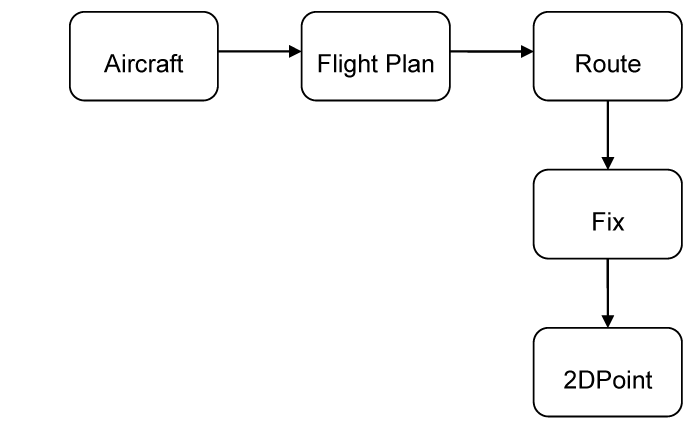
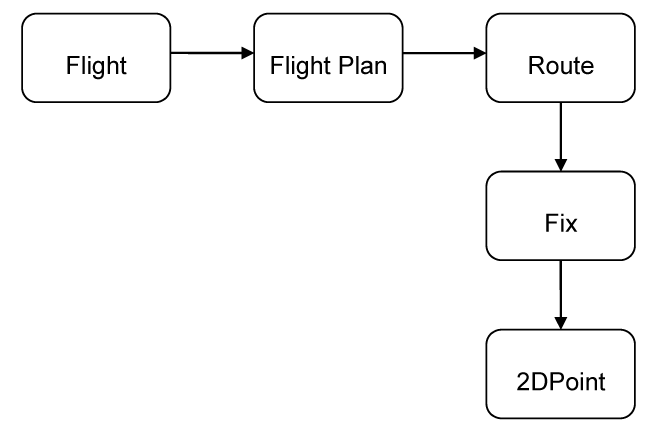

## The Ubiquitous Language 

### The Need for a Common Language 

The previous chapter made the case that it is absolutely necessary to develop a model of the domain by having the the software specialists work with the domain experts; however, that approach usually has some initial difficulties due to a fundamental communication barrier. The developers have their minds full of classes, methods, algorithms, patterns, and tend to always make a match between a real life concept and a programming artifact. They want to see what object classes to create and what relationships to model between them. They think in terms of inheritance, polymorphism, OOP, etc. And they talk like that all the time. And it is normal for them to do so. Developers will be developers. But the domain experts usually know nothing about any of that. They have no idea about software libraries, frameworks, persistence, in many case not even databases. They know about their specific area of expertise. 

In the air traffic monitoring example, the domain experts know about planes, about routes, altitudes, longitudes and latitudes, they know about deviances from the normal route, about plane trajectories. And they talk about those things in their own jargon, which sometimes is not so straightforward to follow by an outsider. 

To overcome this difference in communication style, when we build the model, we must communicate to exchange ideas about the model, about the elements involved in the model, how we connect them, what is relevant and what is not. Communication at this level is paramount for the success of the project. If one says something, and the other does not understand or, even worse, understands something else, what are the chances for the project to succeed? 

A project faces serious problems when team members don’t share a common language for discussing the domain. Domain experts use their jargon while technical team members have their own language tuned for discussing the domain in terms of design.

The terminology of day-to-day discussions is disconnected from the terminology embedded in the code (ultimately the most important product of a software project). And even the same person uses different language in speech and in writing, so that the most incisive expressions of the domain often emerge in a transient form that is never captured in the code or even in writing.

During these sessions of communication, translation is often used to let the others understand what some concepts are about. Developers might try to explain some design patterns using a layman’s language, and sometimes without success. The domain experts will strive to bring home some of their ideas probably by creating a new jargon. During this process communication suffers, and this kind of translation does not help the knowledge building process. 

We tend to use our own dialects during these design sessions, but none of these dialects can be a common language because none serves everyone’s needs.

We definitely need to speak the same language when we meet to talk about the model and to define it. What language is it going to be? The developers’ language? The domain experts’ language? Something in between? 

A core principle of domain-driven design is to use a language based on the model. Since the model is the common ground, the place where the software meets the domain, it is appropriate to use it as the building ground for this language. 

Use the model as the backbone of a language. Request that the team use the language consistently in all communications, and also in the code. While sharing knowledge and hammering out the model, the team uses speech, writing and diagrams. Make sure this language appears consistently in all the communication forms used by the team; for this reason, the language is called the Ubiquitous Language.

The Ubiquitous Language connects all the parts of the design, and creates the premise for the design team to function well. It takes weeks and even months for large scale project designs to take shape. The team members discover that some of the initial concepts were incorrect or inappropriately used, or they discover new elements of the design which need to be considered and fit into the overall design. All this is not possible without a common language.

Languages do not appear overnight. It takes hard work and a lot of focus to make sure that the key elements of the language are brought to light. We need to find those key concepts which define the domain and the design, and find corresponding words for them, and start using them. Some of them are easily spotted, but some are harder.

Iron out difficulties by experimenting with alternative expressions, which reflect alternative models. Then refactor the code, renaming classes, methods, and modules to conform to the new model. Resolve confusion over terms in conversation, in just the way we come to agree on the meaning of ordinary words. 

Building a language like that has a clear outcome: the model and the language are strongly interconnected with one another. A change in the language should become a change to the model.

Domain experts should object to terms or structures that are awkward or inadequate to convey domain understanding. If domain experts cannot understand something in the model or the language, then it is most likely that there is something is wrong with it. On the other hand, developers should watch for ambiguity or inconsistency that will tend to appear in design.

### Creating the Ubiquitous Language 

How can we start building a language? Here is a hypothetical dialog between a software developer and a domain expert in the air traffic monitoring project. Watch out for the words appearing in bold face.

Developer: We want to monitor air traffic. Where do we start?

Expert: Let’s start with the basics. All this traffic is made up of planes. Each plane takes off from a departure place, and lands at a destination place.

Developer: That’s easy. When it flies, the plane can just choose any air path the pilots like? Is it up to them to decide which way they should go, as long as they reach destination?

Expert: Oh, no. The pilots receive a route they must follow. And they should stay on that route as close as possible.

Developer: I’m thinking of this route as a 3D path in the air. If we use a Cartesian system of coordinates, then the route is simply a series of 3D points.

Expert: I don’t think so. We don’t see route that way. The route is actually the projection on the ground of the expected air path of the airplane. The route goes through a series of points on the ground determined by their latitude and longitude.

Developer: OK, then let’s call each of those points a fix, because it’s a fixed point of Earth’s surface. And we’ll use then a series of 2D points to describe the path. And, by the way, the departure and destination are just fixes. We should not consider them as separate concepts. The route reaches destination as it reaches any other fix. The plane must follow the route, but does that mean that it can fly as high or as low as it likes?

Expert: No. The altitude that an airplane is to have at a certain moment is also established in the flight plan.

Developer: Flight plan? What is that?

Expert: Before leaving the airport, the pilots receive a detailed flight plan which includes all sorts of information about the flight: the route, cruise altitude, the cruise speed, the type of airplane, even information about the crew members.

Developer: Hmm, the flight plan seems pretty important to me. Let’s include it into the model. 

Developer: That’s better. Now that I’m looking at it, I realize something. When we are monitoring air traffic, we are not actually interested in the planes themselves, if they are white or blue, or if they are Boeing or Airbus. We are interested in their flight. That’s what we are actually tracking and measuring. I think we should change the model a bit in order to be more accurate.

Notice how this team, talking about the air traffic monitoring domain and around their incipient model, is slowly creating a language made up by the words in boldface. Also note how that language changes the model!

However, in real life such a dialog is much more verbose, and people very often talk about things indirectly, or enter into too much detail, or choose the wrong concepts; this can make coming up with the language very difficult. To begin to address this, all team members should be aware of the need to create a common language and should be reminded to stay focused on essentials, and use the language whenever necessary. We should use our own jargon during such sessions as little as possible, and we should use the Ubiquitous Language because this helps us communicate clearly and precisely.

It is also highly recommended for the developers to implement the main concepts of the model in the code. A class could be written for Route and another for Fix. The Fix class could inherit from a 2DPoint class, or could contain a 2DPoint as its main attribute. That depends on other factors that will be discussed later. By creating classes for the corresponding model concepts, we are mapping between the model and the code, and between the language and the code. This is very helpful as it makes the code more readable, and makes it reproduce the model. Having the code express the model pays off later in the project, when the model grows large, and when changes in the code can have undesirable consequences if the code was not properly designed.

We have seen how the language is shared by the entire team, and also how it helps building knowledge and create the model. What should we use for the language? Just speech? We’ve used diagrams. What else? Writing? 

Some may say that UML is good enough to build a model upon. And indeed it is a great tool to write down key concepts as classes, and to express relationships between them. You can draw four or five classes on a sketchpad, write down their names, and show the relationships between them. It’s very easy for everyone to follow what you are thinking, and a graphical expression of an idea is easy to understand. Everyone instantly shares the same vision about a certain topic, and it becomes simpler to communicate based on that. When new ideas come up, and the diagram is modified to reflect the conceptual change.

UML diagrams are very helpful when the number of elements involved is small. But UML can grow like mushrooms after a nice summer rain. What do you do when you have hundreds of classes filling up a sheet of paper as long as Mississippi? It’s hard to read even by the software specialists, not to mention domain experts. They won’t understand much of it when it gets big, and it does so even for medium size projects.

Also, UML is good at expressing classes, their attributes and relationships between them. But the classes’ behavior and the constraints are not so easily expressed. For that UML resorts to text placed as notes into the diagram. So UML cannot convey two important aspects of a model: the meaning of the concepts it represents and what the objects are supposed to do. But that is OK, since we can add other communication tools to do it.

We can use documents. One advisable way of communicating the model is to make some small diagrams each containing a subset of the model. These diagrams would contain several classes, and the relationship between them. That already includes a good portion of the concepts involved. Then we can add text to the diagram. The text will explain behavior and constraints which the diagram cannot. Each such subsection attempts to explain one important aspect of the domain, it points a “spotlight” to enlighten one part of the domain. 

Those documents can be even hand-drawn, because that transmits the feeling that they are temporary, and might be changed in the near future, which is true, because the model is changed many times in the beginning before it reaches a more stable status. 

It might be tempting to try to create one large diagram over the entire model. However, most of the time such diagrams are almost impossible to put together. And furthermore, even if you do succeed in making that unified diagram, it will be so cluttered that it will not convey the understanding better then did the collection of small diagrams.

Be aware of long documents. It takes a lot of time to write them, and they may become obsolete before they are finished. The documents must be in sync with the model. Old documents, using the wrong language, and not reflecting the model are not very helpful. Try to avoid them when possible.

It is also possible to communicate using code. This approach is widely advocated by the XP community. Well written code can be very communicative. Although the behavior expressed by a method is clear, is the method name as clear as its body? Assertions of a test talk for themselves, but how about the variable names and overall code structure? Are they telling the whole story, loud and clear? Code functionally does the right thing does not necessarily express the right thing. Writing a model in code is very difficult.

There are other ways to communicate during design. It’s not the purpose of this book to present all of them. One thing is nonetheless clear: the design team, made up of software architects, developers, and domain experts, needs a language that unifies their actions, and helps them create a model and express that model with code.