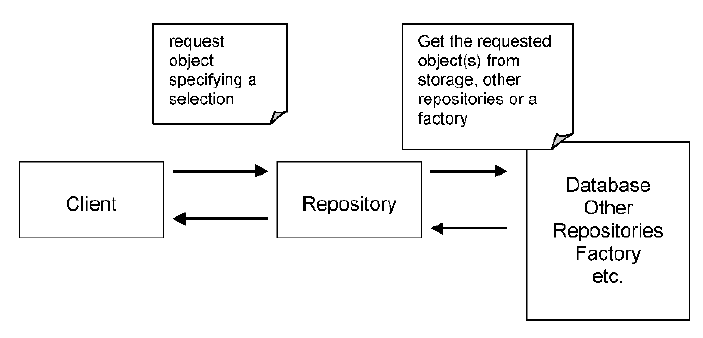

### Repositories  

In a model-driven design, objects have a life cycle starting with creation and ending with deletion or archiving. A constructor or a Factory takes care of object creation. The entire purpose of creating objects is to use them. In an object-oriented language, one must hold a reference to an object in order to be able to use it. To have such a reference, the client must either create the object or obtain it from another, by traversing an existing association. For example, to obtain a Value Object of an Aggregate, the client must request it from the root of the Aggregate. The problem is now that the client must have a reference to the root. For large applications, this becomes a problem because one must make sure the client always has a reference to the object needed, or to another which has a reference to the respective object. Using such a rule in the design will force the objects to hold on a series of references they probably wouldn’t keep otherwise. This increases coupling, creating a series of associations which are not really needed.

To use an object means the object has already been created. If the object is the root of an Aggregate, then it is an Entity, and chances are it will be stored in a persistent state in a database or another form of persistence. If it is a Value Object, it may be obtainable from an Entity by traversing an association. It turns out that a great deal of objects can be obtained directly from the database. This solves the problem of getting reference of objects. When a client wants to use an object, it accesses the database, retrieves the object from it and uses it. This seems like a quick and simple solution, but it has negative impacts on the design.

Databases are part of the infrastructure. A poor solution is for the client to be aware of the details needed to access a database. For example, the client has to create SQL queries to retrieve the desired data. The database query may return a set of records, exposing even more of its internal details. When many clients have to create objects directly from the database, it turns out that such code is scattered throughout the entire domain. At that point the domain model becomes compromised. It has to deal with lots of infrastructure details instead of dealing with domain concepts. What happens if a decision is made to change the underlying database? All that scattered code needs to be changed to be able to access the new storage. When client code accesses a database directly, it is possible that it will restore an object internal to an Aggregate. This breaks the encapsulation of the Aggregate with unknown consequences. 

A client needs a practical means of acquiring references to preexisting domain objects. If the infrastructure makes it easy to do so, the developers of the client may add more traversable associations, muddling the model. On the other hand, they may use queries to pull the exact data they need from the database, or to pull a few specific objects rather than navigating from Aggregate roots. Domain logic moves into queries and client code, and the Entities and Value Objects become mere data containers. The sheer technical complexity of applying most database access infrastructure quickly swamps client code, which leads developers to dumb-down the domain layer, which makes the model irrelevant. The overall effect is that the domain focus is lost and the design is compromised.

Therefore, use a Repository, the purpose of which is to encapsulate all the logic needed to obtain object references. The domain objects won’t have to deal with the infrastructure to get the needed references to other objects of the domain. They will just get them from the Repository and the model is regaining its clarity and focus.

The Repository may store references to some of the objects. When an object is created, it may be saved in the Repository, and retrieved from there to be used later. If the client requested an object from the Repository, and the Repository does not have it, it may get it from the storage. Either way, the Repository acts as a storage place for globally accessible objects.

The Repository may also include a Strategy. It may access one persistence storage or another based on the specified Strategy. It may use different storage locations for different type of objects. The overall effect is that the domain model is decoupled from the need of storing objects or their references, and accessing the underlying persistence infrastructure. 

For each type of object that needs global access, create an object that can provide the illusion of an in-memory collection of all objects of that type. Set up access through a well-known global interface. Provide methods to add and remove objects, which will encapsulate the actual insertion or removal of data in the data store. Provide methods that select objects based on some criteria and return fully instantiated objects or collections of objects whose attribute values meet the criteria, thereby encapsulating the actual storage and query technology. Provide repositories only for Aggregate roots that actually need direct access. Keep the client focused on the model, delegating all object storage and access to the Repositories.

A Repository may contain detailed information used to access the infrastructure, but its interface should be simple. A Repository should have a set of methods used to retrieve objects. The client calls such a method and passes one or more parameters which represent the selection criteria used to select an object or a set of matching objects. An Entity can be easily specified by passing its identity. Other selection criteria can be made up of a set of object attributes. The Repository will compare all the objects against that set and will return those that satisfy the criteria. The Repository interface may contain methods used to perform some supplementary calculations like the number of objects of a certain type.

It can be noted that the implementation of a repository can be closely liked to the infrastructure, but that the repository interface will be pure domain model.

Another option is to specify a selection criteria as a Specification. The Specification allows defining a more complex criteria, such as in the following: 

There is a relationship between Factory and Repository. They are both patterns of the model-driven design, and they both help us to manage the life cycle of domain objects. While the Factory is concerned with the creation of objects, the Repository takes care of already existing objects. The Repository may cache objects locally, but most often it needs to retrieve them from a persistent storage. Objects are either created using a constructor or they are passed to a Factory to be constructed. For this reason, the Repository may be seen as a Factory, because it creates objects. It is not a creation from scratch, but a reconstitution of an object which existed. We should not mix a Repository with a Factory. The Factory should create new objects, while the Repository should find already created objects. When a new object is to be added to the Repository, it should be created first using the Factory, and then it should be given to the Repository which will store it like in the example below. 

Another way this is noted is that Factories are “pure domain”, but that Repositories can contain links to the infrastructure, e g the database.