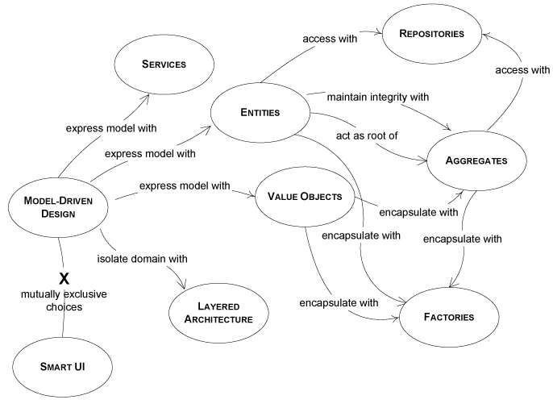

### Building Blocks Of A Model‑Driven Design

The following sections of this chapter will present the most important of patterns to be used in model-driven design. The purpose of these patterns is to present some of the key elements of object modeling and software design from the viewpoint of domain-driven design. The following diagram is a map of the patterns presented and the relationships between them.

