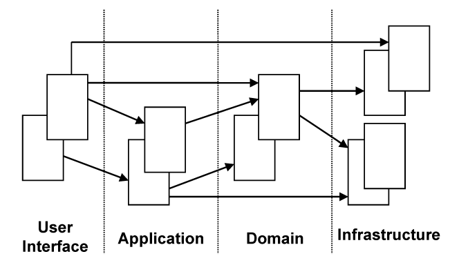

### Layered Architecture

When we create a software application, a large part of the application is not directly related to the domain, but it is part of the infrastructure or serves the software itself. It is possible and ok for the domain part of an application to be quite small compared to the rest, since a typical application contains a lot of code related to database access, file or network access, user interfaces, etc.

In an object-oriented program, UI, database, and other support code often gets written directly into the business objects. Additional business logic is embedded in the behavior of UI widgets and database scripts. This some times happens because it is the easiest way to make things work quickly. 

However, when domain-related code is mixed with the other layers, it becomes extremely difficult to see and think about. Superficial changes to the UI can actually change business logic. To change a business rule may require meticulous tracing of UI code, database code, or other program elements. Implementing coherent, model-driven objects becomes impractical. Automated testing is awkward. With all the technologies and logic involved in each activity, a program must be kept very simple or it becomes impossible to understand. 

Therefore, partition a complex program into LAYERS. Develop a design within each LAYER that is cohesive and that depends only on the layers below. Follow standard architectural patterns to provide loose coupling to the layers above. Concentrate all the code related to the domain model in one layer and isolate it from the user interface, application, and infrastructure code. The domain objects, free of the responsibility of displaying themselves, storing themselves, managing application tasks, and so forth, can be focused on expressing the domain model. This allows a model to evolve to be rich enough and clear enough to capture essential business knowledge and put it to work.

A common architectural solution for domain-driven designs contain four conceptual layers:

User Interface (Presentation Layer) Responsible for presenting information to the user and interpreting user commands.

Application Layer This is a thin layer which coordinates the application activity. It does not contain business logic. It does not hold the state of the business objects, but it can hold the state of an application task progress.

Domain Layer This layer contains information about the domain. This is the heart of the business software. The state of business objects is held here. Persistence of the business objects and possibly their state is delegated to the infrastructure layer.

Infrastructure Layer This layer acts as a supporting library for all the other layers. It provides communication between layers, implements persistence for business objects, contains supporting libraries for the user interface layer, etc.

It is important to divide an application in separate layers, and establish rules of interactions between the layers. If the code is not clearly separated into layers, it will soon become so entangled that it becomes very difficult to manage changes. One simple change in one section of the code may have unexpected and undesirable results in other sections. The domain layer should be focused on core domain issues. It should not be involved in infrastructure activities. The UI should neither be tightly connected to the business logic, nor to the tasks which normally belong to the infrastructure layer. An application layer is necessary in many cases. There has to be a manager over the business logic which supervises and coordinates the overall activity of the application.

For example, a typical, the interaction of the application, domain and infrastructure could look like this. The user wants to book a flights route, and asks an application service in the application layer to do so. The application tier fetches the relevant domain objects from the infrastructure and invokes relevant methods on them, e g to check security margins to other already booked flights. Once the domain objects have made all checks and updated their status to “decided”, the application service persists the objects to the infrastructure.