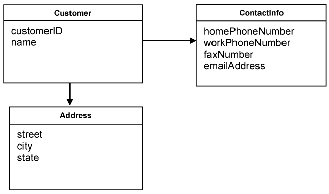

### Aggregates  

The last three patterns in this chapter will deal with a different modeling challenge, one related to the life cycle of domain objects. Domain objects go through a set of states during their life time. They are created, placed in memory and used in computations, and they are destroyed. In some cases they are saved in permanent locations, like a database, where they can be retrieved from some time later, or they can be archived. At some point they can be completely erased from the system, including database and the archive storage.

Managing the life cycle of a domain object constitutes a challenge in itself, and if it is not done properly, it may have a negative impact on the domain model. We will present three patterns which help us deal with it. Aggregate is a domain pattern used to define object ownership and boundaries. Factories and Repositories are two design patterns which help us deal with object creation and storage. We will start by talking about Aggregates.

A model can contain a large number of domain objects. No matter how much consideration we put in the design, it happens that many objects are associated with one another, creating a complex net of relationships. There are several types of associations. For every traversable association in the model, there has to be corresponding software mechanism which enforces it. Real associations between domain object end up in the code, and many times even in the database. A one-to-one relationship between a customer and the bank account opened on his name is expressed as a reference between two objects, and implies a relationship between two database tables, the one which keeps the customers and the one which keeps the accounts.

The challenges of models are most often not to make them complete enough, but rather to make them as simple and understandable as possible. Most of the time it pays of to eliminate or simplify relations from the model. That is, unless they embed deep understanding of the domain. 

A one-to-many association is more complex because it involves many objects which become related. This relationship can be simplified by transforming it into an association between one object and a collection of other objects, although it is not always possible.

There are many-to-many associations and a large number of them are bidirectional. This increases complexity a lot, making the life cycle management of such objects quite difficult. The number of associations should be reduced as much as possible. Firstly, associations which are not essential for the model should be removed. They may exist in the domain, but they are not necessary in our model, so take them out. Secondly, multiplicity can be reduced by adding a constraint. If many objects satisfy a relationship, it is possible that only one will do it if the right constraint is imposed on the relationship. Thirdly, many times bidirectional associations can be transformed in unidirectional ones. Each car has an engine, and every engine has a car where it runs. The relationship is bidirectional, but it can be easily simplified considering that the car has an engine, and not the other way around.

After we reduce and simplify associations between objects, we may still end up with many relationships. A banking system holds and processes customer data. This data includes customer personal data, like name, address, phone numbers, job description, and account data: account number, balance, operations performed, etc. When the system archives or completely deletes information about a customer, it has to make sure that all the references are removed. If many objects hold such references, it is difficult to ensure that they are all removed. Also, when some data changes for a customer, the system has to make sure that it is properly updated throughout the system, and data integrity is guaranteed. This is usually left to be addressed at database level. Transactions are used to enforce data integrity. But if the model was not carefully designed, there will be a high degree of database contention, resulting in poor performance. While database transactions play a vital role in such operations, it is desirable to solve some of the problems related to data integrity directly in the model.

It is also necessary to be able to enforce the invariants. The invariants are those rules which have to be maintained whenever data changes. This is difficult to realize when many objects hold references to changing data objects.

It is difficult to guarantee the consistency of changes to objects in a model with complex associations. Many times invariants apply to closely related objects, not just discrete ones. Yet cautious locking schemes cause multiple users to interfere pointlessly with each other and make a system unusable.

Therefore, use Aggregates. An Aggregate is a group of associated objects which are considered as one unit with regard to data changes. The Aggregate is demarcated by a boundary which separates the objects inside from those outside. Each Aggregate has one root. The root is an Entity, and it is the only object accessible from outside. The root can hold references to any of the aggregate objects, and the other objects can hold references to each other, but an outside object can hold references only to the root object. If there are other Entities inside the boundary, the identity of those entities is local, making sense only inside the aggregate.

How is the Aggregate ensuring data integrity and enforcing the invariants? Since other objects can hold references only to the root, it means that they cannot directly change the other objects in the aggregate. All they can do is to change the root, or ask the root to perform some actions. And the root will be able to change the other objects, but that is an operation contained inside the aggregate, and it is controllable. If the root is deleted and removed from memory, all the other objects from the aggregate will be deleted too, because there is no other object holding reference to any of them. When any change is done to the root which indirectly affects the other objects in the aggregate, it is simple to enforce the invariants because the root will do that. It is much harder to do so when external objects have direct access to internal ones and change them. Enforcing the invariants in such a circumstance involves putting some logic in external objects to deal with it, which is not desirable.

It is possible for the root to pass transient references of internal objects to external ones, with the condition that the external objects do not hold the reference after the operation is finished. One simple way to do that is to pass copies of the Value Objects to external objects. It does not really matter what happens to those objects, because it won’t affect the integrity of the aggregate in any way.

If objects of an Aggregate are stored in a database, only the root should be obtainable through queries. The other objects should be obtained through traversal associations.

Objects inside an Aggregate should be allowed to hold references to roots of other Aggregates.

The root Entity has global identity, and is responsible for maintaining the invariants. Internal Entities have local identity.

Cluster the Entities and Value Objects into Aggregates and define boundaries around each. Choose one Entity to be the root of each Aggregate, and control all access to the objects inside the boundary through the root. Allow external objects to hold references to the root only. Transient references to internal members can be passed out for use within a single operation only. Because the root controls access, it cannot be blindsided by changes to the internals. This arrangement makes it practical to enforce all invariants for objects in the Aggregate and for the Aggregate as a whole in any state change.

A simple example of an Aggregation is shown in the following diagram. The customer is the root of the Aggregate, and all the other objects are internal. If the Address is needed, a copy of it can be passed to external objects.

