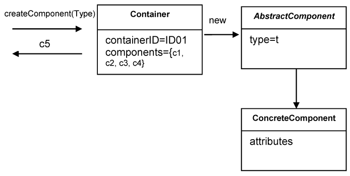
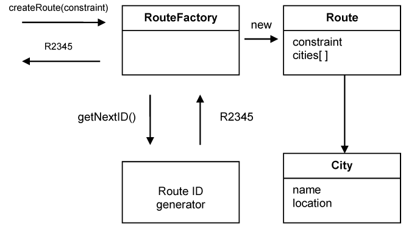

### Factories  

Entities and Aggregates can often be large and complex – too complex to create in the constructor of the root entity. Infact trying to construct a complex aggregate in its constructure is in contradiction with what often happens in the domain itself, where things are created by other things (like electronics get created in on assembly lines). It is like having the printer build itself. 

When a client object wants to create another object, it calls its constructor and possibly passes some parameters. But when the object construction is a laborious process, creating the object involves a lot of knowledge about the internal structure of the object, about the relationships between the objects contained, and the rules applied to them. This means that each client of the object will hold specific knowledge about the object built. This breaks encapsulation of the domain objects and of the Aggregates. If the client belongs to the application layer, a part of the domain layer has been moved outside, messing up the entire design. In real life, it is like we are given plastic, rubber, metal, silicon, and we are building our own printer. It’s not impossible, but is it really worth doing it?

Creation of an object can be a major operation in itself, but complex assembly operations do not fit the responsibility of the created objects. Combining such responsibilities can produce ungainly designs that are hard to understand. 

Therefore, a new concept is necessary to be introduced, one that help to encapsulate the process of complex object creation. This is called Factory. Factories are used to encapsulate the knowledge necessary for object creation, and they are especially useful to create Aggregates. When the root of the Aggregate is created, all the objects contained by the Aggregate are created along with it, and all the invariants are enforced.

It is important for the creation process to be atomic. If it is not, there is a chance for the creation process to be half done for some objects, leaving them in an undefined state. This is even more true for Aggregates. When the root is created, it is necessary that all objects subject to invariants are created too. Otherwise the invariants cannot be enforced. For immutable Value Objects it means that all attributes are initialized to their valid state. If an object cannot be created properly, an exception should be raised, making sure that an invalid value is not returned.

Therefore, shift the responsibility for creating instances of complex objects and Aggregates to a separate object, which may itself have no responsibility in the domain model but is still part of the domain design. Provide an interface that encapsulates all complex assembly and that does not require the client to reference the concrete classes of the objects being instantiated. Create entire Aggregates as a unit, enforcing their invariants.

There are several design patterns used to implement Factories. The book Design Patterns by Gamma et all. describes them in detail, and presents these two patterns among others: Factory Method, Abstract Factory. We won’t try to present the patterns from a design perspective, but from a domain modeling one.

A Factory Method is an object method which contains and hides knowledge necessary to create another object. This is very useful when a client wants to create an object which belongs to an Aggregate. The solution is to add a method to the Aggregate root, which takes care of the object creation, enforces all invariants, and returns a reference to that object, or to a copy of it.

The container contains components and they are of a certain type. It is necessary that when such a component is created to automatically belong to a container. The client calls the createComponent(Type t) method of the container. The container instantiates a new component. The concrete class of the component is determined based on its type. After its creation, the component is added to the collection of components contained by the container, and a copy of it is returned to the client.

There are times when the construction of an object is more complex, or when the creation of an object involves the creation of a series of objects. For example: the creation of an Aggregate. Hiding the internal construction needs of an Aggregate can be done in a separate Factory object which is dedicated to this task. Let’s consider the example of a program module which computes the route that can be followed by a car from departure to destination being given a series of constraints. The user logs in the web site running the application and specifies one of the following constraints: the shortest route, the fastest route, the cheapest route. The routes created can be annotated with user information which needs to be saved, so they can be later retrieved when the customer logs in again.

The Route ID generator is used to create a unique identity for each route which is necessary for an Entity.

When creating a Factory, we are forced to violate an object’s encapsulation, which must be done carefully. Whenever something changes in the object that has an impact on construction rules or on some of the invariants, we need to make sure the Factory is updated to support the new condition. Factories are tightly related to the objects they are created. That can be a weakness, but it can also be a strength. An Aggregate contains a series of objects that are closely related. The construction of the root is related to the creation of the other objects in the Aggregate. There has to be some logic which puts together an Aggregate. The logic does not naturally belong to any of the objects, because it is about the construction of other objects. It seems appropriate to use a special Factory class which is given the task of creating the entire Aggregate, and which will contain the rules, the constraints and the invariants which have to be enforced for the Aggregate to be valid. The objects will remain simple and will serve their specific purpose without the clutter of complex construction logic.

Entity Factories and Value Object Factories are different. Values are usually immutable objects, and all the necessary attributes need to be produced at the time of creation. When the object is created, it has to be valid and final. It won’t change. Entities are not immutable. They can be changed later, by setting some of the attributes with the mention that all invariants need to be respected. Another difference comes from the fact that Entities need identity, while Value Objects do not.

There are times when a Factory is not needed, and a simple constructor is enough. Use a constructor when:

- The construction is not complicated.
- The creation of an object does not involve the creation of others, and all the attributes needed are passed via the constructor.
- The client is interested in the implementation, perhaps wants to choose the Strategy used.
- The class is the type. There is no hierarchy involved, so no need to choose between a list of concrete implementations.

Another observation is that Factories need to create new objects from scratch, or they are required to reconstitute objects which previously existed, but have been probably persisted to a database. Bringing Entities back into memory from their resting place in a database involves a completely different process than creating a new one. One obvious difference is that the new object does not need a new identity. The object already has one. Violations of the invariants are treated differently. When a new object is created from scratch, any violation of invariants ends up in an exception. We can’t do that with objects recreated from a database. The objects need to be repaired somehow, so they can be functional, otherwise there is data loss.