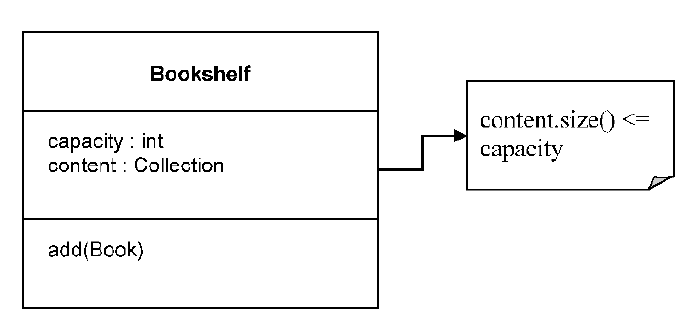

## Refactoring Toward Deeper Insight

### Continuous Refactoring

So far we have been talking about the domain, and the importance of creating a model which expresses the domain. We gave some guidelines about the techniques to be used to create a useful model. The model has to be tightly associated with the domain it comes from. We have also said that the code design has to be done around the model, and the model itself should be improved based on design decisions. Designing without a model can lead to software which is not true to the domain it serves, and may not have the expected behavior. Modeling without feedback from the design and without developers being involved leads to a model which is not well understood by those who have to implement it, and may not be appropriate for the technologies used. 

During the design and development process, we need to stop from time to time, and take a look at the code. It may be time for a refactoring. Refactoring is the process of redesigning the code to make it better without changing application behavior. Refactoring is usually done in small, controllable steps, with great care so we don’t break functionality or introduce some bugs. After all, the purpose of refactoring is to make the code better not worse. Automated tests are of great help to ensure that we haven’t broken anything.

There are many ways to do code refactoring. There are even refactoring patterns. Such patterns represent an automated approach to refactoring. There are tools built on such patterns making the developer’s life much easier than it used to be. Without those tools refactoring can be very difficult. This kind of refactoring deals more with the code and its quality.

There is another type of refactoring, one related to the domain and its model. Sometimes there is new insight into the domain, something becomes clearer, or a relationship between two elements is discovered. All that should be included in the design through refactoring. It is very important to have expressive code that is easy to read and understand. From reading the code, one should be able to tell what the code does, but also why it does it. Only then can the code really capture the substance of the model.

Technical refactoring, the one based on patterns, can be organized and structured. Refactoring toward deeper insight cannot be done in the same way. We cannot create patterns for it. The complexity of a model and the variety of models do not offer us the possibility to approach modeling in a mechanistic way. A good model is the result of deep thinking, insight, experience, and flair.

One of the first things we are taught about modeling is to read the business specifications and look for nouns and verbs. The nouns are converted to classes, while the verbs become methods. This is a simplification, and will lead to a shallow model. All models are lacking depth in the beginning, but we should refactor the model toward deeper and deeper insight.

The design has to be flexible. A stiff design resists refactoring. Code that was not built with flexibility in mind is code hard to work with. Whenever a change is needed, you’ll see the code fighting you, and things that should be refactored easily take a lot of time. 

Using a proven set of basic building blocks along with consistent language brings some sanity to the development effort. This leaves the challenge of actually finding an incisive model, one that captures subtle concerns of the domain experts and can drive a practical design. A model that sloughs off the superficial and captures the essential is a deep model. This should make the software more in tune with the way the domain experts think and more responsive to the user’s needs.

Traditionally, refactoring is described in terms of code transformations with technical motivations. Refactoring can also be motivated by an insight into the domain and a corresponding refinement of the model or its expression in code.
Sophisticated domain models are seldom developed except through an iterative process of refactoring, including close involvement of the domain experts with developers interested in learning about the domain.

### Bring Key Concepts Into Light

Refactoring is done in small steps. The result is also a series of small improvements. There are times when lots of small changes add very little value to the design, and there are times when few changes make a lot of difference. It’s a Breakthrough.

We start with a coarse, shallow model. Then we refine it and the design based on deeper knowledge about the domain, on a better understanding of the concerns. We add new concepts and abstractions to it. The design is then refactored. Each refinement adds more clarity to the design. This creates in turn the premises for a Breakthrough.

A Breakthrough often involves a change in thinking, in the way we see the model. It is also a source of great progress in the project, but it also has some drawbacks. A Breakthrough may imply a large amount of refactoring. That means time and resources, something we seem to never have enough. It is also risky, because ample refactoring may introduce behavioral changes in the application.

To reach a Breakthrough, we need to make the implicit concepts explicit. When we talk to the domain experts, we exchange a lot of ideas and knowledge. Some of the concepts make their way into the Ubiquitous Language, but some remain unnoticed at the beginning. They are implicit concepts, used to explain other concepts which are already in the model. During this process of design refinement, some of those implicit concepts draw our attention. We discover that some of them play a key role in the design. At that point we should make the respective concepts explicit. We should create classes and relationships for them. When that happens, we may have the chance of a Breakthrough.

Implicit concepts should not stay that way. If they are domain concepts, they should be present in the model and the design. How do we recognize them? The first way to discover implicit concepts is to listen to the language. The language we are using during modeling and design contains a lot of information about the domain. At the beginning it may not be so much, or some of the information may not be correctly used. Some of the concepts may not be fully understood, or even completely misunderstood. This is all part of learning a new domain. But as we build our Ubiquitous Language, the key concepts make their way into it. That is where we should start looking for implicit concepts.

Sometimes sections of the design may not be so clear. There is a set of relationships that makes the path of computation hard to follow. Or the procedures are doing something complicated which is hard to understand. This is awkwardness in the design. This is a good place to look for hidden concepts. Probably something is missing. If a key concept is missing from the puzzle, the others will have to replace its functionality. This will fatten up some objects, adding them behavior which is not supposed to be there. The clarity of the design will suffer. Try to see if there is a missing concept. If one is found, make it explicit. Refactor the design to make it simpler and suppler.

When building knowledge it is possible to run into contradictions. What a domain expert says seem to contradict what another upholds. A requirement may seem to contradict another. Some of the contradictions are not really contradictions, but different ways of seeing the same thing, or simply lack of accuracy in explanations. We should try to reconcile contradictions. Sometimes this brings to light important concepts. Even if it does not, it is still important to keep everything clear. 

Another obvious way of digging out model concepts is to use domain literature. There are books written on almost any possible topic. They contain lots of knowledge about the respective domains. The books do not usually contain models for the domains they present. The information they contain needs to be processed, distilled and refined. Nonetheless, the information found in books is valuable, and offers a deep view of the domain.

There are other concepts which are very useful when made explicit: Constraint, Process and Specification. A Constraint is a simple way to express an invariant. Whatever happens to the object data, the invariant is respected. This is simply done by putting the invariant logic into a Constraint. The following is a simple example. Its purpose is to explain the concept, not to represent the suggested approach for a similar case.



We can add books to a bookshelf, but we should never add more than its capacity. This can be seen as part of the Bookshelf behavior, like in the next Java code.

```java
public class Bookshelf {
    private int capacity = 20;
    private Collection content;

    public void add(Book book) {
        if(content.size() + 1 <= capacity) {
            content.add(book);
        } else {
            throw new IllegalOperationException(
            “The bookshelf has reached its limit.”);
        }
    }
}
```

We can refactor the code, extracting the constraint in a separate method.

```java
public class Bookshelf {
    private int capacity = 20;
    private Collection content;

    public void add(Book book) {
        if(isSpaceAvailable()) {
            content.add(book);
        } else {
            throw new IllegalOperationException(
            “The bookshelf has reached its limit.”);
        }
    }

    private boolean isSpaceAvailable() {
        return content.size() < capacity;
    }
}
```

Placing the Constraint into a separate method has the advantage of making it explicit. It is easy to read and everybody will notice that the add() method is subject to this constraint. There is also room for growth adding more logic to the methods if the constraint becomes more complex.

Processes are usually expressed in code with procedures. We won’t use a procedural approach, since we are using an object-oriented language, so we need to choose an object for the process, and add a behavior to it. The best way to implement processes is to use a Service. If there are different ways to carry out the process, then we can encapsulate the algorithm in an object and use a Strategy. Not all processes should be made explicit. If the Ubiquitous Language specifically mentions the respective process, then it is time for an explicit implementation.

The last method to make concepts explicit that we are addressing here is Specification. Simply said, a Specification is used to test an object to see if it satisfies a certain criteria.

The domain layer contains business rules which are applied to Entities and Value Objects. Those rules are usually incorporated into the objects they apply to. Some of these rules are just a set of questions whose answer is “yes” or “no”. Such rules can be expressed through a series of logical operations performed on Boolean values, and the final result is also a Boolean. One such example is the test performed on a Customer object to see if it is eligible for a certain credit. The rule can be expressed as a method, named isEligible(), and can be attached to the Customer object. But this rule is not a simple method which operates strictly on Customer data. Evaluating the rule involves verifying the customer’s credentials, checking to see if he paid his debts in the past, checking to see if he has outstanding balances, etc. Such business rules can be large and complex, bloating the object to the point that it no longer serves its original purpose. At this point we might be tempted to move the entire rule to the application level, because it seems that it stretches beyond the domain level. Actually, it is time for a refactoring. 

The rule should be encapsulated into an object of its own, which becomes the Specification of the Customer, and should be kept in the domain layer. The new object will contain a series of Boolean methods which test if a certain Customer object is eligible for credit or not. Each method plays the role of a small test, and all methods combined give the answer to the original question. If the business rule is not comprised in one Specification object, the corresponding code will end up being spread over a number of objects, making it inconsistent.

The Specification is used to test objects to see if they fulfill some need, or if they are ready for some purpose. It can also be used to select a certain object from a collection, or as a condition during the creation of an object. 

Often a single Specification checks if a simple rule is satisfied, and then a number of such specifications are combined into a composite one expressing the complex rule, like this:

```java
Customer customer = customerRepository.findCustomer(customerIdentiy);
…
Specification customerEligibleForRefund = new Specification(
    new CustomerPaidHisDebtsInThePast(), 
    new CustomerHasNoOutstandingBalances());

if(customerEligibleForRefund.isSatisfiedBy(customer) {
    refundService.issueRefundTo(customer);
}
```

Testing simple rules is simpler, and just from reading this code it is obvious what it means that a customer is eligible for a refund.