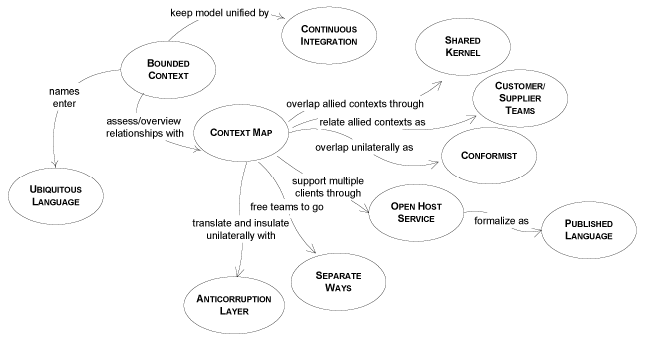

## Preserving Model Integrity

This chapter is about large projects which require the combined efforts of multiple teams. We are faced with a different set of challenges when multiple teams, under different management and coordination, are set on the task of developing a project. Enterprise projects are usually large projects, which employ various technologies and resources. The design of such projects should still be based on a domain model, and we need to take appropriate measure to ensure the success of the project.

When multiple teams work on a project, code development is done in parallel, each team being assigned a specific part of the model. Those parts are not independent, but are more or less interconnected. They all start with one big model, and they are given a share of it to implement. Let’s say that one of the teams has created a module, and they make it available for other teams to use it. A developer from another team starts using the module, and discovers that it is missing some functionality needed for his own module. He adds the needed functionality and checks-in the code so it can be used by all. What he might not realize is that this is actually a change of the model, and it is quite possible that this change will break application functionality. This can easily happen, as nobody takes the time to fully understand the entire model. Everybody knows his own backyard, but other areas are not known in enough detail. 

It is so easy to start from a good model and progress toward an inconsistent one. The first requirement of a model is to be consistent, with invariable terms and no contradictions. The internal consistency of a model is called unification. An enterprise project could have one model covering the entire domain of the enterprise, with no contradictions and overlapping terms. A unified enterprise model is an ideal which is not easily accomplished, and sometimes it is not even worth trying it. Such projects need the combined effort of many teams. The teams need a large degree of independence in the development process, because they do not have the time to constantly meet and discuss the design. The coordination of such teams is a daunting task. They might belong to different departments and have separate management. When the design of the model evolves partially independently, we are facing the possibility to lose model integrity. Preserving the model integrity by striving to maintain one large unified model for the entire enterprise project is not going to work. The solution is not so obvious, because it is the opposite of all we have learned so far. Instead of trying to keep one big model that will fall apart later, we should consciously divide it into several models. Several models well integrated can evolve independently as long as they obey the contract they are bound to. Each model should have a clearly delimited border, and the relationships between models should be defined with precision.

We will present a set of techniques used to maintain model integrity. The following drawing presents these techniques and the relationship between them.

