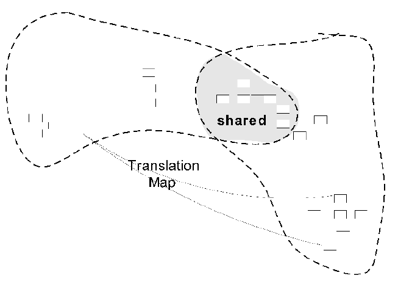

### Shared Kernel

When functional integration is limited, the overhead of Continuous Integration may be deemed too high. This may especially be true when the teams do not have the skill or the political organization to maintain continuous integration, or when a single team is simply too big and unwieldy. So separate Bounded Contexts might be defined and multiple teams formed.

Uncoordinated teams working on closely related applications can go racing forward for a while, but what they produce may not fit together. They can end up spending more on translation layers and retrofitting than they would spend on Continuous Integration in the first place, meanwhile duplicating effort and losing the benefits of a common Ubiquitous Language.

Therefore, designate some subset of the domain model that the two teams agree to share. Of course this includes, along with this subset of the model, the subset of code or of the database design associated with that part of the model. This explicitly shared stuff has special status, and shouldn’t be changed without consultation with the other team. 

Integrate a functional system frequently, but somewhat less often than the pace of Continuous Integration within the teams. During these integrations, run the tests of both teams.

The purpose of the Shared Kernel is to reduce duplication, but still keep two separate contexts. Development on a Shared Kernel needs a lot of care. Both teams may modify the kernel code, and they have to integrate the changes. If the teams use separate copies of the kernel code, they have to merge the code as soon as possible, at least weekly. A test suite should be in place, so every change done to the kernel to be tested right away. Any change of the kernel should be communicated to another team, and the teams should be informed, making them aware of the new functionality.