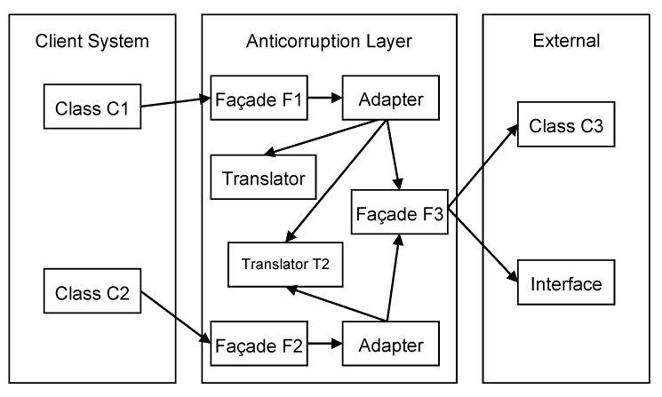

### Anticorruption Layer

We often encounter circumstances when we create an application which has to interact with legacy software or a separate application. This is another challenge for the domain modeler. Many legacy applications have not been built using domain modeling techniques, and their model is confused, entangled hard to understand and hard to work with. Even if it was well done, the legacy application model is not of much use for us, because our model is likely to be quite different. Nonetheless, there has to be a level of integration between our model and the legacy one, because it is one of the requirements to use the old application.

There are different ways for our client system to interact with an external one. One is via network connections. Both applications need to use the same network communication protocols, and the client needs to adhere to the interface used by the external system. Another method of interaction is the database. The external system works with data stored in a database. The client system is supposed to access the same database. In both cases we are dealing with primitive data being transferred between the systems. While this seems to be fairly simple, the truth is that primitive data does not contain any information about the models. We cannot take data from a database and treat it all as primitive data. There is a lot of semantics hidden behind the data. A relational database contains primitive data related to other primitive data creating a web of relationships. The data semantics is very important, and needs to be considered. The client application can’t access the database and write to it without understanding the meaning of the data used. We see that parts of the external model are reflected in the database, and make their way into our model.

There is the risk for the external model to alter the client model if we allow that to happen. We can’t ignore the interaction with the external model, but we should be careful to isolate our own model from it. We should build an Anticorruption Layer which stands between our client model and the external one. From our model’s perspective, the Anticorruption Layer is a natural part of the model; it does not look like something foreign. It operates with concepts and actions familiar to our model. But the Anticorruption Layer talks to the external model using the external language not the client one. This layer works as a two way translator between two domains and languages. The greatest achievement is that the client model remains pure and consistent without being contaminated by the external one.

How should we implement the Anticorruption Layer? A very good solution is to see the layer as a Service from the client model. It is very simple to use a Service because it abstracts the other system and let us address it in our own terms. The Service will do the needed translation, so our model remains insulated. Regarding the actual implementation, the Service will be done as a Façade. (See Design Pattern by Gamma et al. 1995) Besides that, the Anticorruption Layer will most likely need an Adapter. The Adapter allows you to convert the interface of a class to the one understood by the client. In our case the Adapter does not necessarily wrap a class, because its job is to translate between two systems.

The Anticorruption Layer may contain more than one Service. For each Service there is a corresponding Façade, and for each Façade we add an Adapter. We should not use a single Adapter for all Services, because we clutter it with mixed functionality.

We still have to add one more component. The Adapter takes care of wrapping up the behavior of the external system. We also need object and data conversion. This is done using a translator. This can be a very simple object, with little functionality, serving the basic need of data translation. If the external system has a complex interface, it may be better to add an additional Façade between the adapters and that interface. This will simplify the Adapter’s protocol, and separate it from the other system.