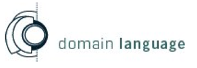

Реклама от имени Эрика Эванса

#### Наши услуги

Мы помогаем амбициозным программным проектам раскрыть потенциал DDD и agile процессов.

Чтобы доменное моделирование и проектирование действительно заработали в проекте, нужно, чтобы стратегический уровень и детальные решения сходились в одно целое. Поэтому мы предлагаем набор услуг, который помогает по-настоящему поставить процесс DDD на рельсы.

Наши обучающие курсы и практикующие наставники укрепляют базовые навыки команды в моделировании и во внедрении эффективной реализации. Наши коучи фокусируют усилия команды и сглаживают шероховатости процесса, которые мешают спроектировать систему, максимально значимую для бизнеса. Наши консультанты по стратегическому проектированию берут на себя задачи, влияющие на траекторию всего проекта, помогая сформировать большую картину, которая поддерживает разработку и направляет проект к целям организации.

#### Начните с оценки

Оценка, которую мы проводим, даст вам и общий взгляд на ситуацию, и конкретные рекомендации. Мы проясним, где вы сейчас, куда хотите прийти, и начнём намечать дорожную карту того, как добраться до цели.

#### Как запланировать оценку

По расценкам, расписанию и дополнительной информации звоните 415-401-7020 или пишите на info@ domainlanguage.com.

www.domainlanguage.com