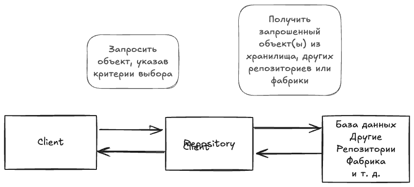
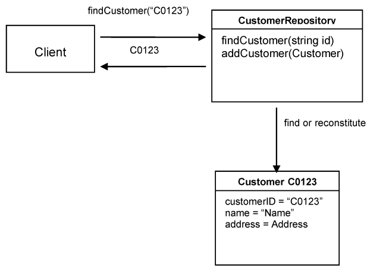
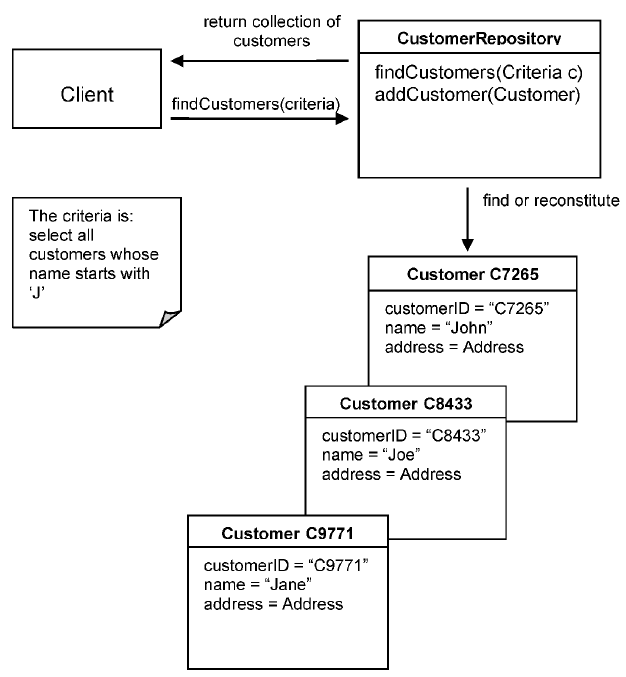
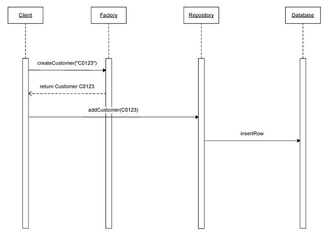

### Репозитории  

В модельно-ориентированном проектировании у объектов есть жизненный цикл, который начинается с создания и заканчивается удалением или архивированием. Созданием объекта занимается конструктор или Фабрика. Смысл создания объектов целиком в том, чтобы ими пользоваться. В объектно-ориентированном языке, чтобы пользоваться объектом, нужно держать на него ссылку. Чтобы получить такую ссылку, клиент должен либо создать объект, либо получить его от другого объекта, пройдя по существующей ассоциации. Например, чтобы получить Объект-значение из Агрегата, клиент должен запросить его у корня агрегата. Проблема в том, что тогда клиенту нужна ссылка на корень. В больших приложениях это становится проблемой, потому что нужно гарантировать, что у клиента всегда есть ссылка на нужный объект или на другой объект, у которого есть ссылка на него. Следование такому правилу в проектировании заставляет объекты удерживать целую цепочку ссылок, которые они, скорее всего, иначе бы не держали. Это увеличивает связность (coupling) и порождает набор ассоциаций, которые на самом деле не нужны.  

Использовать объект означает, что объект уже создан. Если объект является корнем Агрегата, то это Сущность и скорее всего, она будет храниться в постоянном виде в базе данных или в другом хранилище. Если это Объект-значение, его можно получить из сущности, пройдя по ассоциации. Получается, что значительную часть объектов можно получать напрямую из базы данных. Это решает проблему получения ссылок на объекты. Когда клиенту нужно воспользоваться объектом, он обращается к базе данных, извлекает объект и использует его. Это выглядит как быстрое и простое решение, но оно негативно влияет на проектирование.

Базы данных относятся к инфраструктуре. Плохим решением будет когда клиент знает детали, необходимые для доступа к базе данных. Например, клиенту приходится писать SQL запросы, чтобы получить нужные данные. Запрос к базе может вернуть набор записей, раскрывая ещё больше её внутренних деталей. Когда многим клиентам приходится создавать объекты напрямую из базы данных, такой код оказывается разбросан по всему домену. В этот момент доменная модель оказывается скомпрометирована: вместо работы с доменными понятиями ей приходится иметь дело с множеством инфраструктурных деталей. Что произойдёт, если будет принято решение поменять базу данных? Весь этот разбросанный код придётся менять, чтобы он умел работать с новым хранилищем. Когда клиентский код обращается к базе данных напрямую, он может восстановить объект, который является внутренним для Агрегата. Это нарушает инкапсуляцию Агрегата с непредсказуемыми последствиями.

Клиенту нужен практический способ получения ссылок на уже существующие доменные объекты. Если инфраструктура делает это слишком простым, разработчики клиента могут начать добавлять всё больше проходимых ассоциаций, размывая модель. С другой стороны, они могут использовать запросы, чтобы вытаскивать из базы ровно те данные, которые им нужны, или получать несколько конкретных объектов вместо того, чтобы переходить от корней Агрегатов. Доменная логика перемещается в запросы и клиентский код, а Сущности и Объекты-значения становятся лишь контейнерами данных. Техническая сложность большинства инфраструктурных решений для доступа к базе быстро затапливает клиентский код, что приводит к упрощению доменного слоя и делает модель неактуальной. В итоге фокус на домене теряется, и проектирование оказывается скомпрометировано.

Поэтому используйте Репозиторий, цель которых инкапсулировать всю логику, необходимую для получения ссылок на объекты. Доменные объекты не будут заниматься инфраструктурой, чтобы получить нужные ссылки на другие объекты домена. Они просто получают их из Репозиториев, и модель восстанавливает свою ясность и фокус.

Репозиторий может хранить ссылки на некоторые объекты. Когда объект создаётся, его можно сохранить в Репозитории, а затем извлечь оттуда и использовать позже. Если клиент запросил объект у Репозитория, а у Репозитория его нет, он может получить его из хранилища. В любом случае Репозиторий выступает как место хранения глобально доступных объектов.

Репозиторий также может включать паттерн Стратегию. В зависимости от выбранной Стратегии он может обращаться к тому или иному хранилищу. Он может использовать разные хранилища для разных типов объектов. В результате доменная модель оказывается развязана с необходимостью хранить объекты или ссылки на них и с доступом к лежащей в основе инфраструктуре хранения.

Для каждого типа объекта, требующего глобального доступа, создайте объект, который может имитировать коллекцию всех объектов данного типа в памяти. Обеспечьте доступ через известный глобальный интерфейс. Предоставьте методы для добавления и удаления объектов, которые инкапсулируют реальное вставление или удаление данных в хранилище. Предоставьте методы, выбирающие объекты по некоторым критериям и возвращающие полностью инстанцированные объекты или коллекции объектов, чьи значения атрибутов удовлетворяют критериям, тем самым инкапсулируя реальное хранилище и технологию запросов. Предоставляйте **Repositories** только для корней **Aggregates**, которым действительно нужен прямой доступ. Держите клиентский фокус на модели, делегируя всё хранение и доступ к объектам **Repositories**.  

Для каждого типа объектов, к которым нужен глобальный доступ, создайте объект, который создаёт иллюзию коллекции всех объектов этого типа, находящейся в памяти. Организуйте доступ через единый, общеизвестный интерфейс. Предоставьте методы для добавления и удаления объектов, которые будут инкапсулировать реальное добавление или удаление данных в хранилище. Предоставьте методы, выбирающие объекты по некоторым критериям и возвращающие полностью инициализированные объекты или коллекции объектов, значения атрибутов которых удовлетворяют критериям, тем самым инкапсулируя конкретную технологию хранения и выполнения запросов. Создавайте репозитории только для тех корней Агрегатов, которым действительно нужен прямой доступ. Пусть клиент остаётся сфокусирован на модели, делегируя всё хранение объектов и доступ к ним Репозиториям.

Репозиторий может содержать подробную информацию, необходимую для доступа к инфраструктуре, но его интерфейс должен быть простым. Репозиторий должен иметь набор методов для получения объектов. Клиент вызывает такой метод, передавая один или несколько параметров, представляющих критерии выбора, используемые для выбора одного объекта или набора подходящих объектов. Сущность можно легко получить, передав её идентичность. Другие критерии могут состоять из набора атрибутов объекта. Репозиторий сравнит все объекты с этим набором и вернёт те, которые удовлетворяют критериям. Интерфейс репозитория может включать методы для выполнения дополнительных вычислений, например получения количества объектов определённого типа.

Можно отметить, что реализация Репозитория может быть тесно связана с инфраструктурой, но интерфейс Репозитория будет чисто доменной моделью.

Ещё один вариант это задавать критерий выбора в виде паттерна Спецификация. Спецификация позволяет определять более сложные критерии, например такие, как в следующем примере:

Существует связь между **Factory** и **Repository**. Оба являются паттернами проектирования по модели и помогают управлять жизненным циклом доменных объектов. **Factory** отвечает за создание объектов, а **Repository** — за уже существующие объекты. **Repository** может кэшировать объекты локально, но чаще всего ему нужно извлекать их из постоянного хранилища. Объекты либо создаются через конструктор, либо передаются в **Factory** для построения. По этой причине **Repository** иногда рассматривают как **Factory**, потому что он «создаёт» объекты. Это не создание с нуля, а воссоздание уже существующего объекта. Не следует смешивать **Repository** с **Factory**. **Factory** должна создавать новые объекты, а **Repository** — находить уже созданные. Когда новый объект добавляется в **Repository**, его сначала следует создать через **Factory**, а затем передать в **Repository**, который его сохранит, как показано в примере ниже.  

Существует связь между Фабрикой и Репозиторием. Оба они являются паттернами проектирования по модели и помогают управлять жизненным циклом доменных объектов. Если Фабрика занимается созданием объектов, то Репозиторий работает с уже существующими объектами. Репозиторий может кэшировать объекты локально, но чаще всего ему нужно извлекать их из постоянного хранилища. Объекты либо создаются через конструктор, либо передаются Фабрике для построения. Поэтому Репозиторий можно рассматривать как Фабрику, поскольку он тоже создаёт объекты. Только это не создание с нуля, а восстановление объекта, который уже существовал. При этом не следует смешивать Репозиторий и Фабрику. Фабрика должна создавать новые объекты, а Репозиторий находить уже созданные. Когда новый объект нужно добавить в Репозиторий, его сначала следует создать с помощью Фабрики, а затем передать Репозиторию, который сохранит его, как в примере ниже.

Другой способ описания: Фабрик это «чистый домен», а Репозитории могут содержать ссылки на инфраструктуру, например, базу данных.