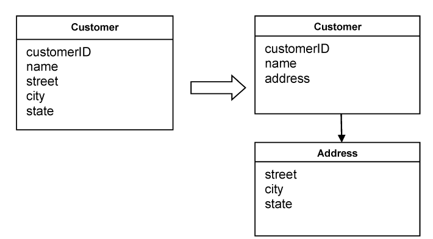

### Объект-значение  

Мы обсудили сущности и важность их раннего распознавания в фазе моделирования. Сущности это необходимые объекты в доменной модели. Должны ли мы делать все объекты сущностями? Должен ли каждый объект иметь идентичность?  

У нас может возникнуть соблазн сделать сущностями все объекты. Сущности можно отслеживать. Но отслеживание и введение идентичности имеют свою цену. Нужно обеспечить, чтобы у каждого экземпляра была уникальная идентичность, а поддерживать её не так просто. Требуется аккуратно продумать, что именно считается идентичностью, потому что ошибка приведёт к ситуации, когда разные объекты получат одну и ту же идентичность, а это недопустимо. Есть также последствия для производительности, если все объекты являются сущностью. Для каждого объекта нужен отдельный экземпляр. Если Customer — сущность, то экземпляр, представляющий конкретного клиента банка, нельзя переиспользовать в операциях по счетам других клиентов. Значит, придётся создавать отдельный экземпляр для каждого клиента. При тысячах таких экземпляров это может ухудшить производительность системы.

Рассмотрим приложение для рисования. Пользователю показывается холст, и он может рисовать точки и линии любой толщины, стиля и цвета. Удобно создать класс Point, а программа может создавать экземпляр этого класса для каждой точки на холсте. Такая точка будет содержать два атрибута, соответствующих координатам на экране или холсте. Нужно ли считать, что у каждой точки есть идентичность? Есть ли у неё “непрерывность” во времени? Похоже, что для такого объекта важно только одно — его координаты.

Бывают случаи, когда нам важно зафиксировать лишь некоторые характеристики элемента предметной области. Нас не интересует, какой именно это объект, важны только его атрибуты. Объект, который описывает определённые аспекты домена и не имеет собственной идентичности, называется объектом-значением (Value Object). 

Важно различать Сущности (Entities) и Объекты-значения (Value Objects). Нецелесообразно делать все объекты сущностями ради единообразия. Напротив, рекомендуется выделять сущностями только те объекты, которые действительно соответствуют определению сущности, а все остальные делать Объектами-значениями. (В следующем разделе будет представлен ещё один тип объекта, но пока будем считать, что у нас есть только сущности и объекты-значения.) Такое разделение упрощает проектирование и даёт и другие положительные эффекты.

Отсутствие идентичности делает Объект-значение легко создаваемыми и удаляемыми. Никто не заботится о создании идентичности, а сборщик мусора удаляет объект, когда на него больше нет ссылок. Это сильно упрощает проектирование.  

Настоятельно рекомендуется делать Объекты-значения неизменяемыми. Они создаются через конструктор и никогда не изменяются в течение своего жизненного цикла. Когда нужен другой набор значений, просто создаётся новый объект. Это существенно влияет на проектирование. Будучи неизменяемыми и не имея идентичности, Объекты-значения можно разделять между разными частями системы. Для некоторых решений это критично. Неизменяемые объекты легко переиспользовать, что может заметно влиять на производительность. Кроме того, они обеспечивают целостность данных. Представьте, что объект, который является изменяемым, используется несколькими клиентами. В системе бронирования авиаперелётов можно создавать объекты для каждого рейса, и одним из атрибутов будет код рейса. Один клиент бронирует рейс на определённое направление. Другой клиент хочет забронировать тот же рейс. Система решает переиспользовать объект, который содержит код рейса, потому что речь об одном и том же рейсе. Но затем первый клиент передумывает и выбирает другой рейс. Система меняет код рейса в этом объекте, ведь он изменяем. В результате код рейса меняется и у второго клиента тоже.

Золотое правило: если Объект-значение совместно используемы, они должны быть неизменяемыми. Объекты-значения должны быть лёгкими и простыми. Когда Объект-значение нужен другой стороне, его можно просто передать по значению, либо создать копию и передать её. Копирование Объекта-значение простое и обычно не имеет последствий. Если нет идентичности, можно создавать сколько угодно копий и уничтожать их по необходимости.

Объекты-значения могут содержать другие Объекты-значения и даже держать ссылки на Сущности. Хотя Объекты-значения используются, чтобы просто хранить атрибуты доменного объекта, это не значит, что они должны включать длинный список всех возможных атрибутов. Атрибуты можно группировать в разные объекты. Атрибуты, из которых составляется Объект-значение, должны образовывать единое концептуальное целое. Например, Customer связан с именем, улицей, городом и штатом. Лучше вынести адресную информацию в отдельный объект, а объект Customer будет содержать ссылку на него. Street, City и State логичнее объединить в отдельный объект — Address, потому что концептуально они принадлежат друг другу, а не являются разрозненными атрибутами Customer, как показано на диаграмме ниже.

