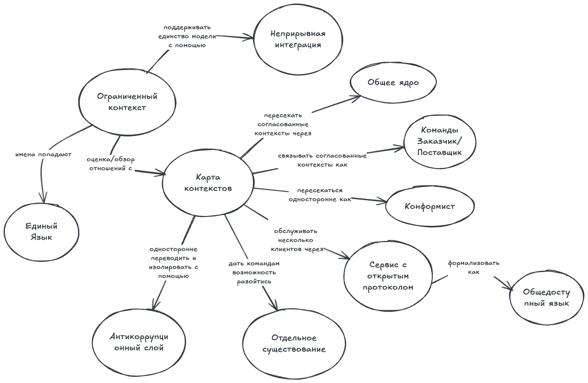

## Сохранение целостности модели

Эта глава про большие проекты, которые требуют совместной работы нескольких команд. Когда над проектом работают несколько команд с разным управлением и координацией, мы сталкиваемся с другим набором вызовов. Корпоративные проекты обычно крупные: в них используются разные технологии и ресурсы. Проектирование таких проектов всё равно должно опираться на доменную модель, и нам нужно принять подходящие меры, чтобы обеспечить успех проекта.

Когда несколько команд работают над проектом, разработка кода идёт параллельно: каждой команде поручают конкретную часть модели. Эти части не независимы — они в той или иной степени связаны между собой. Все начинают с одной большой модели, и каждой команде дают «долю» этой модели для реализации. Допустим, одна из команд создала модуль и сделала его доступным для использования другими командами. Разработчик из другой команды начинает использовать модуль и обнаруживает, что в нём не хватает функциональности, нужной для его собственного модуля. Он добавляет нужную функциональность и вносит изменения в общий репозиторий, чтобы этим могли пользоваться все. При этом он может не осознавать, что на самом деле это изменение модели, и вполне возможно, что такое изменение сломает функциональность приложения. Это легко происходит, потому что никто не находит времени полностью понять всю модель. Каждый хорошо знает свой участок ответственности, но остальные области не известны в достаточных деталях.

Очень легко начать с хорошей модели и постепенно прийти к несогласованной. Первое требование к модели это согласованность: единая терминология и отсутствие противоречий. Внутренняя согласованность модели называется унификацией. В корпоративном проекте могла бы быть одна модель, покрывающая всю предметную область организации, без противоречий и дублирующих друг друга терминов. Единая корпоративная модель это идеал, которого сложно достичь, а иногда и вовсе не стоит пытаться. Такие проекты требуют совместной работы многих команд. Командам нужна высокая степень независимости в разработке, потому что у них нет времени постоянно встречаться и обсуждать проектирование. Координировать такие команды — крайне сложная задача. Они могут относиться к разным подразделениям и иметь разное руководство. Когда проектирование модели развивается частично независимо, появляется риск потерять целостность модели. Сохранять целостность модели, пытаясь поддерживать одну большую унифицированную модель для всего корпоративного проекта, не получится. Решение не так очевидно, потому что оно противоположно тому, чему мы до сих пор учились. Вместо того чтобы пытаться удержать одну большую модель, которая позже развалится, нужно осознанно разделить её на несколько моделей. Несколько хорошо интегрированных моделей могут развиваться независимо, пока соблюдают соглашение, которое их связывает. У каждой модели должна быть чётко очерченная граница, а связи между моделями должны быть определены точно.

Мы рассмотрим набор техник, которые используют, чтобы сохранять целостность модели. На следующей схеме показаны эти техники и связи между ними.

