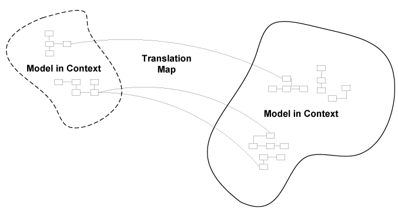

### Карта контекстов

В корпоративном приложении обычно существует несколько моделей, и у каждой модели есть свой Ограниченный контекст (Bounded Context). Рекомендуется использовать контекст как основу для организации команды. Людям в одной команде проще коммуницировать, и в итоге они лучше справляются с интеграцией модели и реализации. При этом, пока каждая команда работает над своей моделью, полезно, чтобы у всех было представление об общей картине. Карта контекстов (Context Map) это документ, который описывает разные Ограниченные контексты и отношения между ними. Карта контекстов может быть диаграммой, как на рисунке ниже, или любым текстовым документом. Уровень детализации может отличаться. Важно, чтобы все, кто работает над проектом, разделяли эту карту и одинаково её понимали.

Недостаточно иметь отдельные цельные модели. Их нужно интегрировать, потому что функциональность каждой модели — это лишь часть всей системы. В итоге эти части придётся собрать вместе, и вся система должна корректно работать как единое целое. Если границы контекстов определены нечётко, они могут начать перекрываться. Если отношения между контекстами не зафиксированы, есть риск, что при интеграции системы они просто не будут работать вместе.

Каждый Ограниченный контекстдолжен иметь имя, и это имя должно быть частью Единого языка. Это сильно помогает командной коммуникации, когда речь идёт о системе целиком. Все должны понимать границы каждого контекста и соответствие между контекстами и кодом. Распространённая практика: сначала определить контексты, затем создать модули под каждый контекст и использовать соглашение об именовании, чтобы было ясно, к какому контексту относится каждый модуль.

На следующих страницах мы поговорим о взаимодействии между разными контекстами. Мы рассмотрим набор паттернов, которые можно использовать при построении Карты контекстов, где у контекстов есть чёткие роли, а их отношения явно обозначены. Общее ядро и Заказчик-Поставщик это паттерны с высокой степенью взаимодействия между контекстами.Separate Ways применяется, когда мы хотим, чтобы контексты были максимально независимыми и развивались отдельно. Есть ещё два паттерна, которые описывают взаимодействие системы с легаси-системой или внешней системой: Open Host Service и Anticorruption Layer.